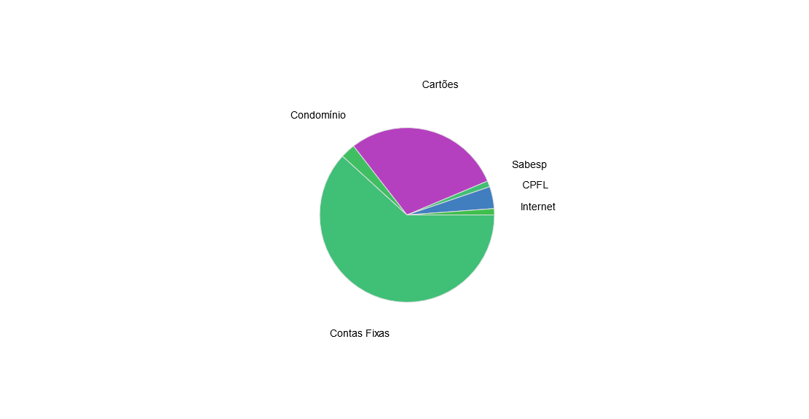

# PieChart-JS
A very simplistic example of how creating a PieCart using only Vanilla JavaScript

## How to use
Just clone the repository and open the index.html on your browser.
To modify the static values on PieChart only update the data variable below with your desired values.

```javascript
    let data = [
        {name: 'Contas Fixas', value: 5300},
        {name: 'Condomínio', value: 235},
        {name: 'Cartões', value: 2500},
        {name: 'Sabesp', value: 95},
        {name: 'CPFL', value: 350},
        {name: 'Internet', value: 99.99},
    ];
```

## Example


## License
MIT License

## Author
Eduardo Diogo Garcia / eduardo.diogo@gmail.com
